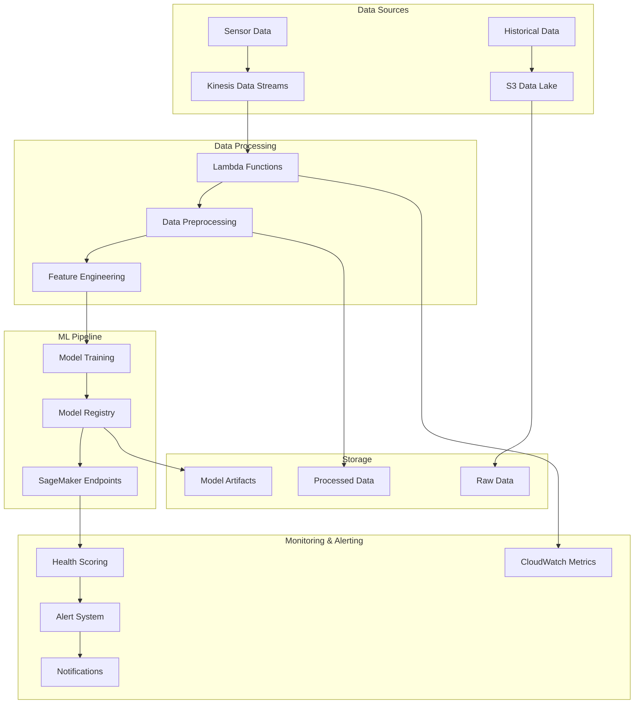

# System Architecture

## Overview

The Predictive Maintenance for Sensor Time-Series system is designed as a comprehensive, cloud-native solution that leverages AWS services and MLOps best practices to provide real-time monitoring, anomaly detection, and predictive maintenance capabilities for industrial equipment.

## High-Level Architecture



## Component Architecture

### 1. Data Ingestion Layer

**Purpose**: Collect and ingest sensor data from various sources in real-time.

**Components**:
- **Kinesis Data Streams**: Real-time data streaming from sensors
- **S3 Data Lake**: Historical data storage and batch processing
- **Lambda Functions**: Serverless data processing and transformation

**Key Features**:
- Multi-source data ingestion (Kinesis, S3, Kafka, Direct)
- Real-time and batch processing capabilities
- Data validation and quality checks
- Automatic scaling based on data volume

### 2. Data Processing Layer

**Purpose**: Clean, transform, and prepare data for machine learning models.

**Components**:
- **Data Preprocessing**: Cleaning, normalization, and outlier detection
- **Feature Engineering**: Time-series features, rolling statistics, health indicators
- **Stream Processing**: Real-time data processing with configurable batching

**Key Features**:
- Automated data cleaning and validation
- Advanced feature engineering for time-series data
- Real-time anomaly detection
- Health score calculation
- Parallel processing support

### 3. Machine Learning Layer

**Purpose**: Train, deploy, and manage ML models for predictive maintenance.

**Components**:
- **Anomaly Detection**: Isolation Forest, One-Class SVM, LSTM Autoencoder
- **Failure Prediction**: Random Forest, Gradient Boosting, LSTM, Prophet
- **Health Scoring**: Multi-sensor integration, clustering-based scoring
- **Model Registry**: MLflow for experiment tracking and model versioning

**Key Features**:
- Multiple ML algorithms for different use cases
- Ensemble methods for improved accuracy
- Automated model training and validation
- Model versioning and deployment
- A/B testing capabilities

### 4. AWS Services Integration

**Purpose**: Leverage AWS cloud services for scalability and reliability.

**Components**:
- **S3**: Data lake storage and model artifacts
- **Lambda**: Serverless compute for real-time processing
- **SageMaker**: ML model training and deployment
- **Kinesis**: Real-time data streaming
- **CloudWatch**: Monitoring and logging

**Key Features**:
- Serverless architecture for cost optimization
- Auto-scaling based on demand
- High availability and fault tolerance
- Integration with AWS security services

### 5. MLOps Pipeline

**Purpose**: Automate ML model lifecycle management.

**Components**:
- **CI/CD Pipeline**: GitHub Actions for automated testing and deployment
- **Data Versioning**: DVC for data pipeline versioning
- **Model Registry**: MLflow for experiment tracking
- **Automated Retraining**: Data drift detection and model retraining

**Key Features**:
- Automated model training and deployment
- Data drift detection and alerting
- Model performance monitoring
- Automated rollback capabilities

### 6. Monitoring and Alerting

**Purpose**: Monitor system health and provide real-time alerts.

**Components**:
- **Metrics Collection**: System and application metrics
- **Alerting System**: Multi-channel notifications (Email, Slack, SNS)
- **Dashboards**: Grafana and custom Plotly dashboards
- **CloudWatch Integration**: AWS native monitoring

**Key Features**:
- Real-time monitoring and alerting
- Multiple notification channels
- Customizable dashboards
- Historical trend analysis

## Data Flow

### 1. Real-Time Data Flow

```
Sensor Data → Kinesis → Lambda → Feature Engineering → Model Inference → Alerts
```

1. **Data Ingestion**: Sensor data is streamed to Kinesis Data Streams
2. **Real-Time Processing**: Lambda functions process data in real-time
3. **Feature Engineering**: Extract time-series features and health indicators
4. **Model Inference**: Deploy models to SageMaker for real-time predictions
5. **Alerting**: Generate alerts based on predictions and thresholds

### 2. Batch Processing Flow

```
Historical Data → S3 → Batch Processing → Model Training → Model Registry → Deployment
```

1. **Data Storage**: Historical data is stored in S3 data lake
2. **Batch Processing**: Process large datasets for model training
3. **Model Training**: Train models using SageMaker or local compute
4. **Model Registry**: Store and version models in MLflow
5. **Deployment**: Deploy models to production endpoints

### 3. MLOps Flow

```
Code Changes → CI/CD → Testing → Model Training → Validation → Deployment → Monitoring
```

1. **Code Changes**: Developers push changes to repository
2. **CI/CD Pipeline**: Automated testing and validation
3. **Model Training**: Retrain models with new data
4. **Validation**: Test model performance and accuracy
5. **Deployment**: Deploy validated models to production
6. **Monitoring**: Monitor model performance and data drift

## Security Architecture

### 1. Data Security

- **Encryption at Rest**: S3 data encrypted with AWS KMS
- **Encryption in Transit**: TLS/SSL for all data transmission
- **Access Control**: IAM roles and policies for fine-grained access
- **Data Classification**: Sensitive data handling and compliance

### 2. Application Security

- **Authentication**: AWS Cognito for user authentication
- **Authorization**: Role-based access control (RBAC)
- **API Security**: API Gateway with rate limiting and throttling
- **Secrets Management**: AWS Secrets Manager for sensitive data

### 3. Infrastructure Security

- **Network Security**: VPC with private subnets and security groups
- **Monitoring**: CloudTrail for audit logging
- **Compliance**: SOC 2, GDPR, and industry-specific compliance
- **Vulnerability Management**: Regular security scanning and updates

## Scalability and Performance

### 1. Horizontal Scaling

- **Kinesis Shards**: Auto-scaling based on data volume
- **Lambda Concurrency**: Automatic scaling for compute resources
- **SageMaker Endpoints**: Multi-instance deployment for high availability
- **S3**: Unlimited storage capacity

### 2. Performance Optimization

- **Caching**: Redis for frequently accessed data
- **Data Partitioning**: Time-based and equipment-based partitioning
- **Batch Processing**: Optimized for large-scale data processing
- **Model Optimization**: Quantization and pruning for faster inference

### 3. Cost Optimization

- **Serverless Architecture**: Pay-per-use pricing model
- **Spot Instances**: Use spot instances for batch processing
- **Data Lifecycle**: Automated data archiving and deletion
- **Resource Right-sizing**: Continuous optimization of resource allocation

## Deployment Architecture

### 1. Environment Strategy

- **Development**: Local development and testing
- **Staging**: Pre-production testing and validation
- **Production**: Live system with high availability

### 2. Infrastructure as Code

- **Terraform**: Infrastructure provisioning and management
- **CloudFormation**: AWS resource management
- **GitOps**: Version-controlled infrastructure changes
- **Automated Deployment**: CI/CD pipeline for infrastructure updates

### 3. Disaster Recovery

- **Multi-Region**: Cross-region replication for critical data
- **Backup Strategy**: Automated backups and point-in-time recovery
- **Failover**: Automated failover to backup systems
- **Recovery Testing**: Regular disaster recovery drills

## Monitoring and Observability

### 1. Metrics and Logging

- **Application Metrics**: Custom metrics for business logic
- **Infrastructure Metrics**: System and resource utilization
- **Log Aggregation**: Centralized logging with CloudWatch Logs
- **Distributed Tracing**: Request tracing across services

### 2. Alerting Strategy

- **Threshold-Based**: Static thresholds for critical metrics
- **Anomaly-Based**: ML-based anomaly detection for alerts
- **Escalation**: Multi-level escalation for critical issues
- **Runbook Integration**: Automated response procedures

### 3. Dashboards

- **Executive Dashboards**: High-level business metrics
- **Operational Dashboards**: Technical metrics and system health
- **Custom Dashboards**: User-specific views and KPIs
- **Real-Time Updates**: Live data updates and notifications

## Technology Stack

### 1. Core Technologies

- **Python 3.9+**: Primary programming language
- **Pandas/NumPy**: Data manipulation and analysis
- **Scikit-learn**: Machine learning algorithms
- **TensorFlow/PyTorch**: Deep learning frameworks
- **MLflow**: MLOps and experiment tracking

### 2. AWS Services

- **S3**: Object storage and data lake
- **Lambda**: Serverless compute
- **SageMaker**: ML platform
- **Kinesis**: Real-time data streaming
- **CloudWatch**: Monitoring and logging
- **SNS/SQS**: Messaging and notifications

### 3. MLOps Tools

- **DVC**: Data version control
- **GitHub Actions**: CI/CD pipeline
- **Docker**: Containerization
- **Kubernetes**: Container orchestration (optional)
- **Prometheus**: Metrics collection
- **Grafana**: Visualization and dashboards

## Future Enhancements

### 1. Advanced Analytics

- **Deep Learning**: More sophisticated neural network models
- **Federated Learning**: Distributed model training
- **AutoML**: Automated model selection and hyperparameter tuning
- **Explainable AI**: Model interpretability and explainability

### 2. Integration Capabilities

- **IoT Integration**: Direct sensor connectivity
- **ERP Integration**: Enterprise system integration
- **CMMS Integration**: Maintenance management system integration
- **API Gateway**: External API access and management

### 3. Advanced Features

- **Digital Twins**: Virtual representations of physical equipment
- **Augmented Reality**: AR-based maintenance guidance
- **Mobile Applications**: Field technician mobile apps
- **Edge Computing**: Local processing for real-time response

This architecture provides a robust, scalable, and maintainable foundation for predictive maintenance systems while leveraging modern cloud technologies and MLOps best practices.
